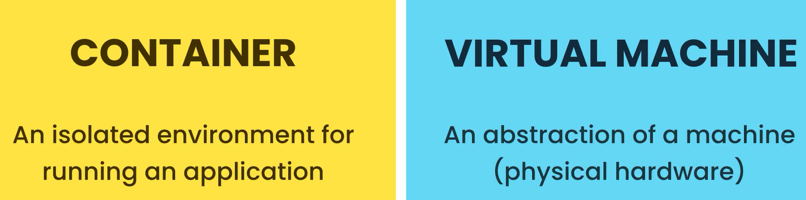
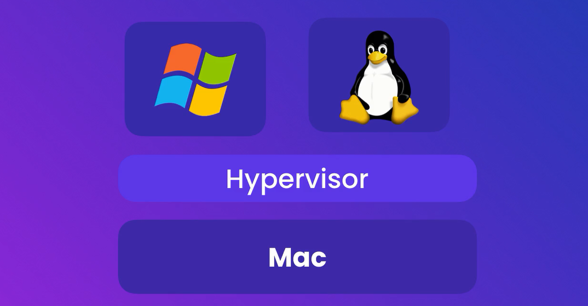
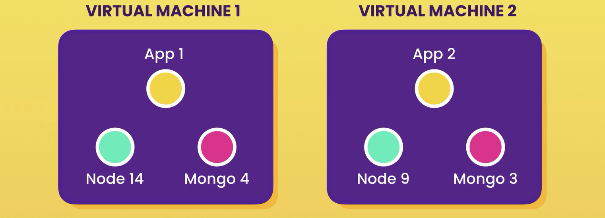
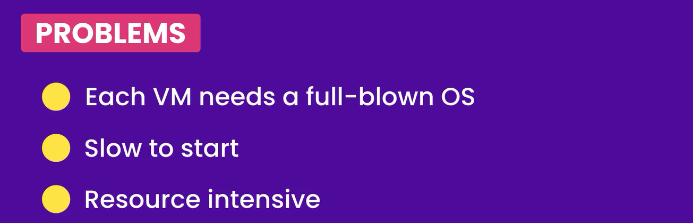
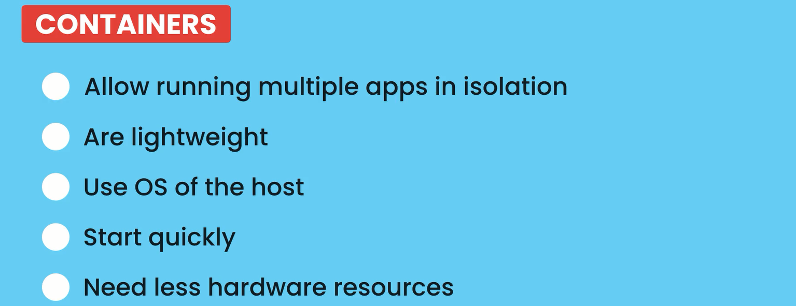

# **The Ultimate Docker Course**

---

# **SECTION 1**

---

1. What is Docker
2. Virtual Machine vs Container
3. Architecture of Docker
4. Installing Docker
5. Development Workflow

---

> Defn: A platform for building, running and shipping applications

--- 

# What is Docker?

---

> Docker is a platform for building, running and shipping applications in a consistent manner. With Docker, if the application works in your machine, it will work in production. Without Docker, this might not happen for three different reasons:

1. files are missing in the deployed version (the application is not fully deployed)
2. software versions mismatch
3. different configuration in different machines (like env variables)

> What Docker does is to package the application with everything it needs to run. Therefore, if it works on the development machine, it will work on testing and production machines as well. Additionally, any new comers will not have to go through a complex local setup, but just use that Docker container.

> You can run multiple Docker containers (for example, multiple applications) in you machine. Each Docker container will generate its needed environment and avoid clashes.

---

##  Virtual Machine vs Container

---

> A VM is an abstraction of a machine (from its physical hardware). We can run multiple VMs in a single physical machines using a special kind of program called a hypervisor. There are multiple hypervisors in the market: like VirtualBox, or VMware. Each VM can run its own software (even the OS).

---

--- 

##  Architecture of Docker

---

> Docker uses a client-server architecture which communicate using a REST API. The server is called the Docker Engine. It sits on the background and takes care of building and running containers. Technically, a container is a process like any other one running in your computer.

> Containers don't share the complete OS of the host, but the kernel of the OS. The kernel is the part of the OS that manages the applications and the allocation of hardware resources. Each operating system has a different kernel and can therefore only run different containers.

> Starting from Windows 10, Windows is shipped with both a Windows kernel and a Linux kernel. Therefore, Windows machines can run both Windows and Linux containers. Each kernel will handle the respective ones. MacOS has a special kernel. It does not have native support for containers. Because of this, containers in MacOS need to run inside a Linux VM.

> Once you've installed Docker in your machine, start it and run docker version on the terminal.

---

--- 

##  Installing Docker

---

> LESSIONS8

