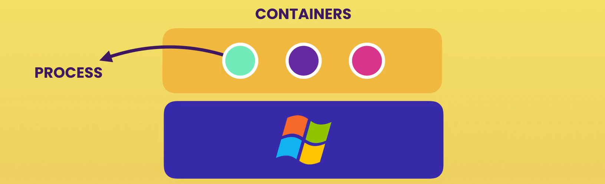
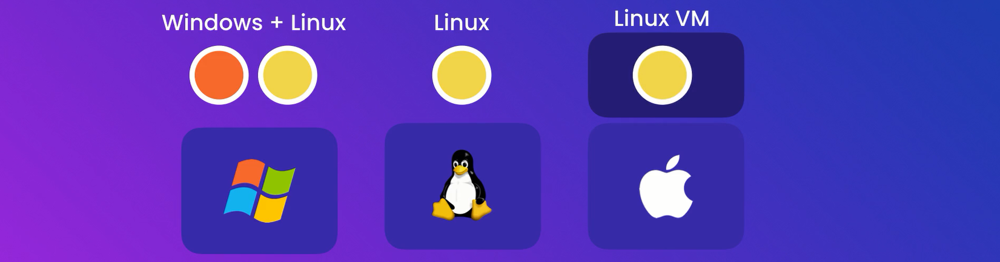

# **The Ultimate Docker Course**

---

# **SECTION 1**

---

1. What is Docker
2. Virtual Machine vs Container
3. Architecture of Docker
4. Installing Docker
5. Development Workflow

---

> Defn: A platform for building, running and shipping applications

--- 

##  Virtual Machine vs Container

---

---

--- 

##  Architecture of Docker

---

---

--- 

##  Installing Docker

---

